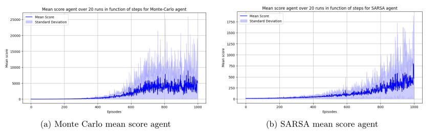
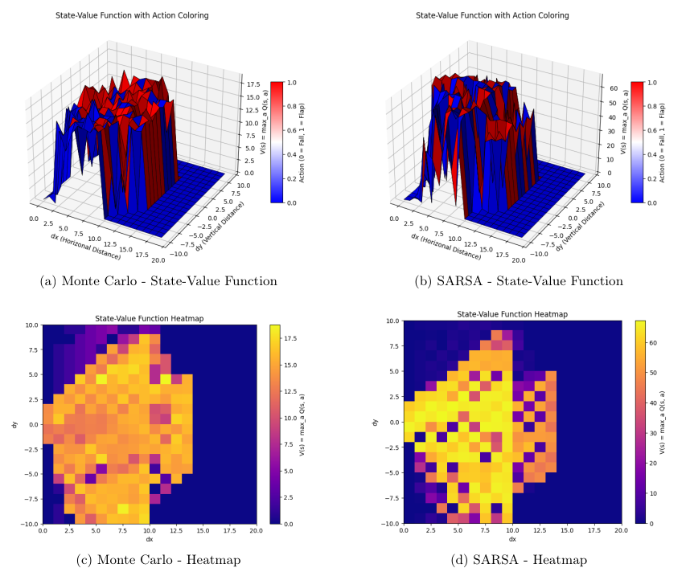
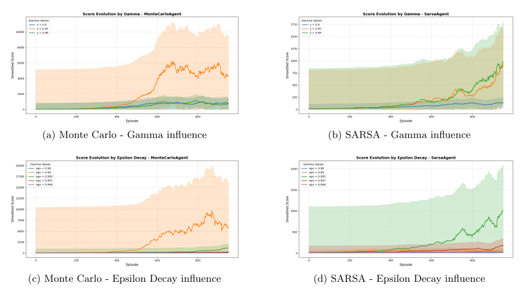

# Monte Carlo vs SARSA: Reinforcement Learning Agents for Text Flappy Bird

## Overview

An in-depth comparison of two tabular RL methods—Monte Carlo and SARSA(λ)—on a simplified Text Flappy Bird environment. This study examines learning curves, value-function estimation, hyperparameter sensitivity, and environment configuration effects to highlight each algorithm’s strengths and limitations.

A detailed report including theoretical background and extended results is available [here](https://github.com/MariusDragic/RL4Flap/blob/main/RL4Flap_Monte_VS_Sarsa.pdf) for interested readers.

## Monte Carlo VS Sarsa agent

This project applies two classical reinforcement learning algorithms to Text Flappy Bird (TFB), a grid-based variant of the popular Flappy Bird game. The environment state at time _t_ is represented by a pair `(dx, dy)` where `dx` is the horizontal distance to the next pipe and `dy` is the vertical offset from the pipe’s center. The agent chooses between two actions: `flap (1)` or `do nothing (0)` and receives a reward of +1 for each timestep it stays alive. 

The goal is to compare:

- **Monte Carlo**: Estimates action-value function `Q(s,a)` from complete-episode returns using an ε-greedy policy.
- **SARSA(λ)**: An on-policy temporal-difference method that updates `Q(s,a)` incrementally at each timestep, incorporating eligibility traces for faster adaptation.

Key hyperparameters (γ, ε, ε-decay, α, λ) are tuned for each algorithm to maximize performance.

## Learning Performance

Average scores over multiple training runs demonstrate that the Monte Carlo agent achieves significantly higher mean returns over 1000 episodes, albeit with greater variance, whereas SARSA(λ) converges more steadily but to a lower plateau.

  

## Value-Function Visualization

Both agents learn to assign higher value to states close to the pipe gap. The Monte Carlo value surface is smoother and more consistent, while SARSA(λ) exhibits higher local variability. Heatmaps beneath each surface confirm these observations.

  

## Hyperparameter Sensitivity

Monte Carlo performs optimally with γ = 0.95 and ε_decay = 0.99, favoring extended exploration. SARSA(λ) achieves better results with γ = 0.99 and ε_decay = 0.995, relying on longer-term reward prediction. Both methods exhibit clear performance degradation when deviating from these settings.

  

## Conclusion

- **Monte Carlo** rapidly explores and converges to high-reward policies but suffers from high variance.
- **SARSA(λ)** learns more stably but attains lower ultimate performance given the same training budget.
- Proper tuning of γ and ε_decay is critical for both methods.
- The simplified TFB environment enables straightforward tabular RL, but generalization to a full-screen version would require function approximation (e.g., Deep Q-Networks).

## References

1. Christodoulidis, S. *Text Flappy Bird Gym*. CentraleSupélec Research, 2024.  
2. Sutton, R. S., & Barto, A. G. *Reinforcement Learning: An Introduction* (2nd ed.), MIT Press, 2018.  
3. Talendar. *Flappy Bird Gym*. GitHub, 2023.  

